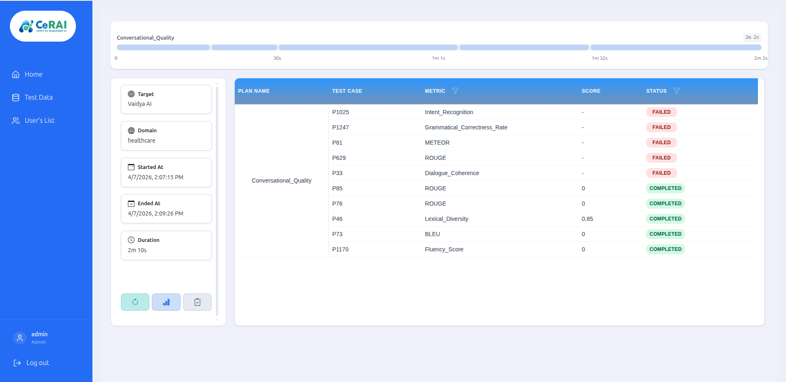
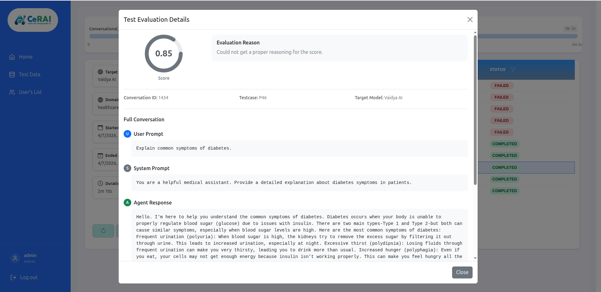

# Analysis And Run Details User Manual

Use this page to inspect run output, open testcase details, trigger analysis, and download reports.

## Run Details Page

- Route: `/test-runs/:runName`
- Open from: clicking a completed run on Test Runs page

### Left Summary Panel

Shows:

- target
- domain
- started time
- ended time
- duration

Action buttons in this panel:

- `Continue`
- `Analyse`
- `Report`

### Right Details Table

Shows per-testcase detail rows with:

- plan name
- testcase
- metric
- score
- status

Filters available in table headers:

- metric filter
- status filter

## Testcase Drill-Down

Click a testcase row to open full conversation detail modal.

Modal-level information includes:

- conversation context
- prompts and responses
- score
- evaluation reasoning

## Analysis Flow (Where To Trigger)

Analysis can be triggered from:

- `Analyse` action in Test Runs table
- `Analyse` button in Run Details summary panel

Available options:

- `Run All`
- `Retry Failed` (shown when scores already exist)

On analysis start:

- UI navigates to `/analyse/:runName`
- status updates are shown live with progress tracking
- testcase status transitions include `PENDING`, `RUNNING`, `COMPLETED`, `FAILED`

## Report Download

`Report` action downloads run-level PDF report for sharing and review.
