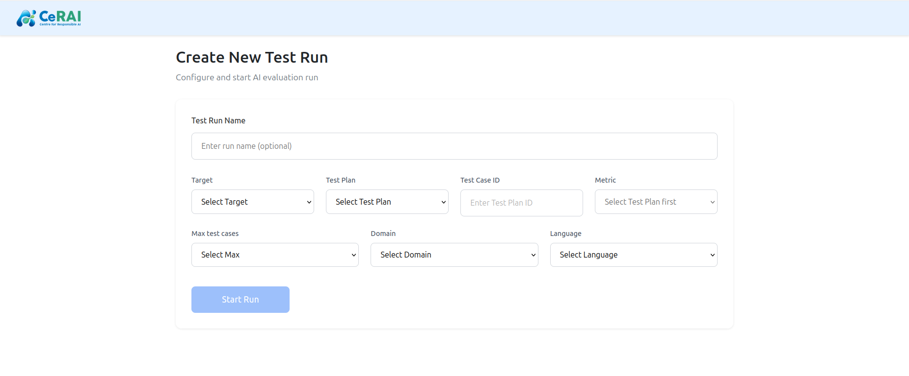

# Run Configuration User Manual

Use this page to configure and execute new runs or continue existing runs.

## A. Create New Test Run

- Route: `/create-test-run`
- Open from: `New Test Run` button on Test Runs page

### Field Locations And Behavior

- `Test Run Name`: optional custom name
- `Target`: required
- `Test Plan`: required
- `Metric`: enabled after selecting `Test Plan`
- `Test Case Name`: enabled after selecting `Test Plan`
- `Max test cases`: execution cap
- `Domain` and `Language`: loaded after selecting `Target`

### Start Action

- Click `Start Run` to execute
- Progress loop shows stages:
  - `Prepare`
  - `Finding elements`
  - `Execute`
  - `Store`

## B. Continue Existing Run

- Route: `/continue-run/:runName`
- Open from: `Continue` action on Test Runs page or Run Details page

### Screen Sections

- `Run Details` accordion:
  - target
  - status
  - start/end timestamps
  - metrics grouped by plan
- `Use Existing or Modify Setup` section:
  - test plan
  - metric
  - testcase name
  - max test cases
  - domain/language

### Continue Action

- Click `Start Run` inside continue configuration
- Same execution loop and progress behavior applies

## Recommended Operator Sequence

1. Use `Create New Test Run` for first execution.
2. Use `Continue Run` for extending or retrying with narrower scope.
3. Move to analysis after responses are collected.
