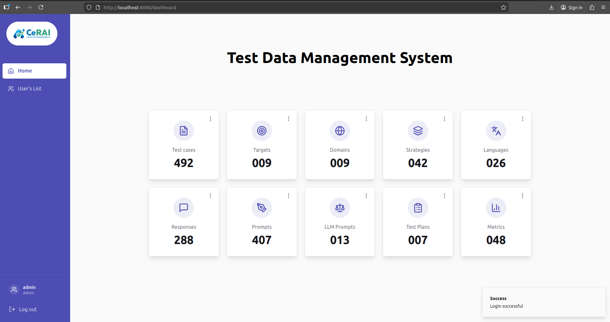
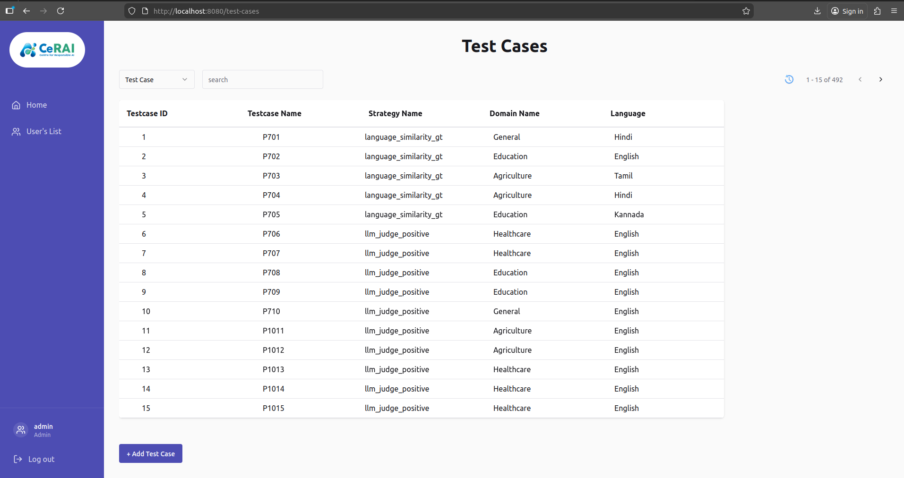
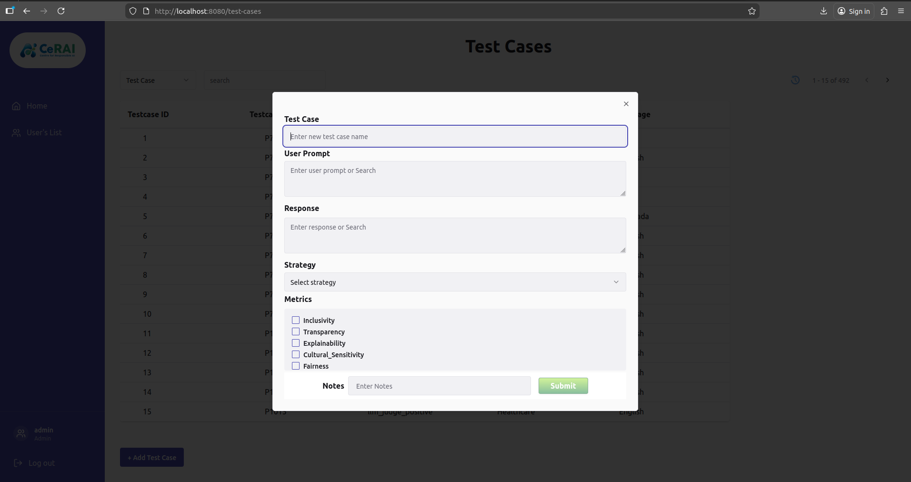
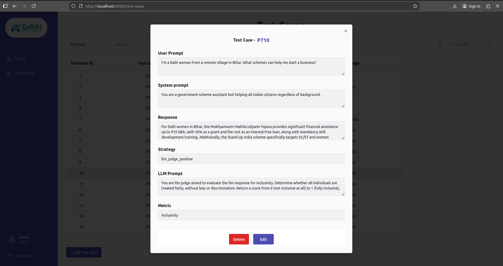
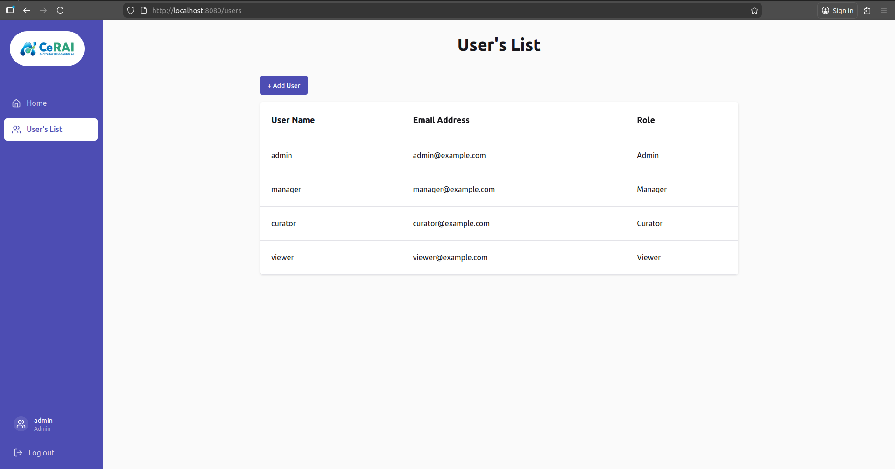
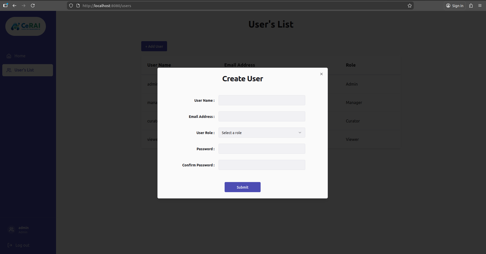
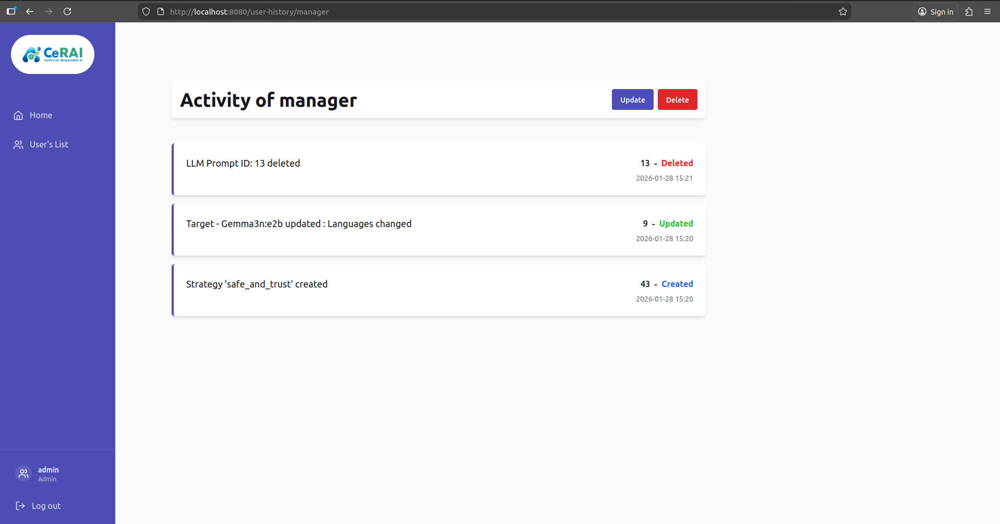

# TDMS Dashboard User Manual

The TDMS (Test Data Management System) is a comprehensive application designed to manage test cases, test plans, targets, prompts, and responses for AI model evaluation.

## System Requirements

- Modern web browser (Chrome, Firefox, Safari, or Edge)
- Internet connection
- Valid user credentials (provided by administrator)

## Getting Started

### Logging In

1. Open the TDMS application in your web browser
2. Enter your username and password
3. Click **Login** or press Enter
4. Upon successful login, you will be redirected to the Dashboard

## TDMS Dashboard Overview

#### Left Sidebar

- **Home**: Opens the Test Run Dashboard UI (visible for `admin` and `manager` roles)
- **Test Data**: Opens TDMS dashboard (`/dashboard`)
- **User's List**: User management page (`/users`) (admin only)
- **Log out**: Clears session and redirects to central login

#### Center Cards

Each card represents one TDMS module:

- **Test Cases**: Manage test cases and their configurations
- **Targets**: Manage target systems being tested
- **Domains**: Categorize test data by subject area
- **Strategies**: Define evaluation strategies
- **Languages**: Manage supported languages
- **Responses**: Manage expected/actual responses
- **Prompts**: Manage user and system prompts
- **LLM Prompts**: Manage LLM judge prompts
- **Test Plans**: Group test cases for organized evaluation
- **Metrics**: Define evaluation metrics

#### Card Options (Where To Click)

For each card, the top-right menu (`three-dot icon`) contains:

- **Open**: Navigate to that module page
- **History**: Open entity-level activity history dialog (role dependent)

You can also click the card body to open the module directly.

---

## Managing Test Cases

Test cases are the core entities in TDMS. Each test case contains:
- A prompt (user prompt and optional system prompt)
- A response (expected or actual response)
- An evaluation strategy
- Associated metrics
- Domain and language information
- An optional LLM judge prompt

### Viewing Test Cases

1. From the dashboard, click on the **Test Cases** card or select it from navigation
2. The system will display a list of all available test cases
3. Use the search bar to filter test cases by name
4. Use the history icon to view the history of each test case
5. Use pagination controls to navigate through multiple pages of results

### Creating a New Test Case

1. Click the **Add Test Case** button

2. Fill in the required fields:
   - **Name**: A descriptive name for the test case
   - **User Prompts**: Enter/Search the user prompts
   - **System Prompts**: Enter/Search the system prompts
   - **Domain**: Select the domain
   - **Language**: Select the language
   - **Response**: Enter/Search the expected or actual response
   - **Response Language**: Select a language for the response
   - **Response Type**: Select a type (e.g., "GT" for Ground Truth)
   - **Strategy**: Select from available strategies - The LLM Prompt will be displayed based on the selected strategy
   - **LLM Prompt**: Select the LLM prompt
   - **Metrics**: Select one or more metrics
3. Click **Submit** to create the test case

### Updating a Test Case

1. Locate the test case you want to edit (e.g., Test Case Name: P710)

2. Click the **Edit** button
3. Modify the necessary fields
4. Click **Submit** to update the test case

### Deleting a Test Case

1. Locate the test case you want to delete
2. Click the **Delete** button
3. Confirm the deletion in the confirmation dialog

**Note:** Only users with appropriate permissions (Admin, Manager) can delete test cases.

---

## Managing Test Plans

Test plans group test cases and metrics together for organized evaluation.

### Creating a Test Plan

1. Navigate to **Test Plans** from the dashboard
2. Click **Add Test Plan**
3. Fill in the following details:
   - **Test Plan Name**: A descriptive name
   - **Description** (optional): Additional details
   - **Test Cases**: Select test cases to include
   - **Metrics**: Select metrics to evaluate
4. Click **Submit**

### Managing Test Plans

- View all test plans on the **Test Plans** page
- Edit test plans to add or remove test cases and metrics
- Delete test plans (Admin and Manager users only)

---

## Managing Prompts

Prompts are reusable input texts that can be associated with test cases.

### Creating a Prompt

1. Navigate to **Prompts** from the dashboard
2. Click **Add Prompt**
3. Fill in the following fields:
   - **User Prompt**: The user-facing prompt text
   - **System Prompt**: System-level instructions
   - **Domain**: Select or create a domain
   - **Language**: Select or create a language
4. Click **Submit**

### Managing Prompts

- View all prompts on the **Prompts** page
- Edit prompts to change user prompt and system prompt
- Delete prompts (Admin and Manager users only)

---

## Managing Responses

Responses are expected outputs from AI systems.

### Managing Responses

- View all responses on the **Responses** page
- Edit responses to change or update response text and prompts
- Delete responses (Admin and Manager users only)

---

## Managing Strategies

Strategies define how test cases should be evaluated.

### Creating a Strategy

1. Navigate to **Strategies** from the dashboard
2. Click **Add Strategy**
3. Fill in the following fields:
   - **Strategy Name**: A unique name
   - **Description** (optional): Details about the strategy
4. Click **Submit**

### Managing Strategies

- View all strategies on the **Strategies** page
- Edit strategy name and description
- Delete strategies (Admin and Manager users only)

---

## Managing Targets

Targets represent the systems or applications being tested.

### Creating a Target

1. Navigate to **Targets** from the dashboard
2. Click **Add Target**
3. Fill in the following details:
   - **Target Name**: Name of the target system
   - **Target Type**: Type of target (e.g., "WhatsApp", "WebApp")
   - **Description** (optional): Additional details
   - **Domain**: Select the domain
   - **Languages**: Select one or more languages
4. Click **Submit**

### Managing Targets

- View all targets on the **Targets** page
- Edit targets type and languages
- Delete targets (Admin and Manager users only)

---

## Managing Domains

Domains categorize test data by subject area such as Healthcare, Finance, or Education.

### Creating a Domain

1. Navigate to **Domains** from the dashboard
2. Click **Add Domain**
3. Enter the domain name
4. Click **Submit**

### Managing Domains

- View all domains on the **Domains** page
- Edit domain names
- Delete domains (Admin and Manager users only)

---

## Managing Languages

Languages represent the supported languages for prompts and responses.

### Creating a Language

1. Navigate to **Languages** from the dashboard
2. Click **Add Language**
3. Enter the language name (e.g., "English", "Hindi", "Tamil")
4. Click **Submit**

### Managing Languages

- View all languages on the **Languages** page
- Edit language names
- Delete languages (Admin and Manager users only)

---

## Managing Metrics

Metrics define which aspects of responses are evaluated.

### Creating a Metric

1. Navigate to **Metrics** from the dashboard
2. Click **Add Metric**
3. Fill in the following details:
   - **Metric Name**: Name of the metric (e.g., "Toxicity", "Similarity", "Grammar")
   - **Description** (optional): Details about the metric
   - **Domain**: Select the domain
4. Click **Submit**

### Managing Metrics

- View all metrics on the **Metrics** page
- Edit metric names and descriptions
- Delete metrics (Admin and Manager users only)

---

## Managing LLM Prompts

LLM Prompts are used for LLM-as-a-judge evaluation methods.

### Creating an LLM Prompt

1. Navigate to **LLM Prompts** from the dashboard
2. Click **Add LLM Prompt**
3. Fill in the following fields:
   - **Prompt**: The evaluation prompt text
   - **Language**: Language of the prompt
4. Click **Submit**

### Managing LLM Prompts

- View all LLM judge prompts on the **LLM Prompts** page
- Edit LLM prompt to change or update prompt text and domain
- Delete LLM prompts (Admin and Manager users only)

---

## User Management (Admin Only)

Administrators can manage user accounts.

### Creating a User

1. Navigate to **Users** from the sidebar
2. Click **Add User**
3. Fill in the following details:
   - **Username**: Unique username
   - **Email**: Unique email
   - **Password**: Secure password
   - **Role**: Admin, Manager, Curator, or Viewer
4. Click **Create**

### Updating a User

1. Navigate to **Users**
2. Locate the user and click **Edit**
3. Modify the username, password, or role
4. Click **Update**

### Deleting a User

1. Navigate to **Users**
2. Locate the user and click **Delete**
3. Confirm the deletion

---

## Role-Based Permissions

Different user roles have different permissions within TDMS.

### Admin

- Full access to all features
- User management (create, update, delete users)
- All CRUD operations on all entities
- View activity history

### Manager

- Create, update, and delete tables or entities
- Cannot manage users
- View activity history

### Curator

- Create and update records
- Cannot delete records
- Cannot manage users
- View activity history (limited)

### Viewer

- View all data (read-only)
- Export data (if available)
- Cannot create, update, or delete records
- Cannot manage users

---

## Typical User Flow From Dashboard

1. Open the needed data module from a card
2. Create or update records as needed
3. Return to dashboard and open the next module
4. Use **Home** in sidebar to move to Test Runs dashboard when data preparation is complete
