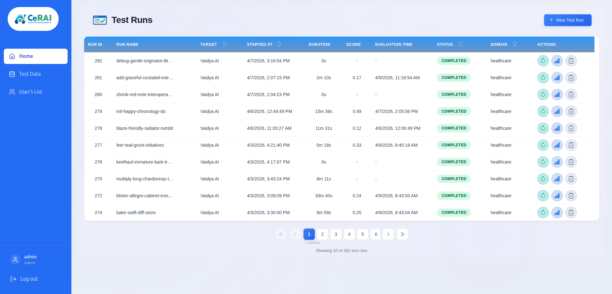

# Test Runs User Manual

Use this page to understand the Test Runs home screen in the Test Case Execution Dashboard.

## Where This Screen Is

- Route: `/`
- Page title: `Test Runs`
- Entry button at top-right: `New Test Run`

## Main Areas

### Header

- Left: `Test Runs` title
- Right: `New Test Run` button (opens `/create-test-run`)

### Test Runs Table

Columns shown:

- `Run Id`
- `Run Name`
- `Target`
- `Started At`
- `Duration`
- `Score`
- `Evaluation Time`
- `Status`
- `Domain`
- `Actions`

### Filters And Sorting

- Column filters are available on `Target`, `Status`, and `Domain`
- Sorting is available on start/end time fields
- Pagination is available at the bottom

## Row Actions (Where To Click)

Each row contains:

- `Continue` icon: open Continue Run page
- `Analyse` icon: open analysis options (`Run All`, `Retry Failed` when applicable)
- `Report` icon: download PDF evaluation report

## Row Click Behavior

- Clicking a completed row opens run details (`/test-runs/:runName`)
- Clicking a `RUNNING` or `NEW` row shows warning and does not open details

## Practical Usage

1. Review status and score of all runs.
2. Filter to the target/domain/status of interest.
3. Continue, analyse, or report from row actions.
4. Open completed runs for detailed investigation.
